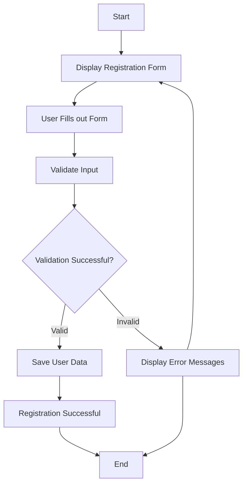

# Creckett 
 
### [Milestones](https://github.com/fssa-batch3/sec_a_arunkumar.dhanraj__corejava_project_2/milestones)
### ER Diagram:
###   

### Flow:

```mermaid  
flowchart TD
A[Start]  
B[Display Registration Form]  
C[User Fills out Form]  
D[Validate Input]  
E{Validation Successful?}  
F[Save User Data]  
G[Registration Successful]  
H[Display Error Messages]  
I[End]  
A --> B  
B --> C  
C --> D  
D --> E  
E -- Valid --> F  
F --> G  
E -- Invalid --> H  
H --> B  
H --> I  
G --> I  
```
